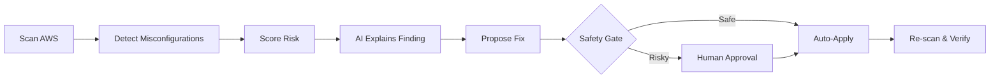
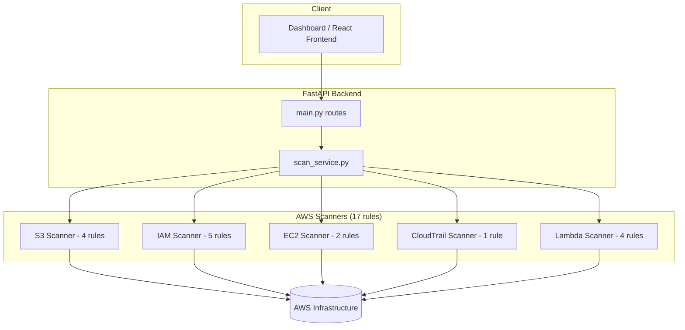

# ☁️ CloudSentinel

**AI-Powered AWS Cloud Security Scanning & Auto-Remediation Platform**

[](https://www.python.org/)
[](https://fastapi.tiangolo.com/)
[](https://aws.amazon.com/)
[](LICENSE)

---

## 📌 Overview

**CloudSentinel** continuously discovers AWS cloud resources, detects security misconfigurations, calculates risk scores, and utilizes AI to explain security findings while offering automated, safety-gated remediation workflows.

The detection core implements **17 security rules** across 5 major AWS services (S3, IAM, EC2, CloudTrail, and Lambda), verified against live AWS environment benchmarks.

---

## 🔄 Pipeline & Architecture



### System Architecture



---

## 🛡️ Security Rules & Coverage

| Service | Rules Implemented | Key Inspections |
|---|:---:|---|
| **S3 Bucket** | 4 rules | Block Public Access, Public bucket detection, Bucket versioning, Encryption at rest |
| **IAM** | 5 rules | Root account MFA, Password policy compliance, User MFA, Wildcard permissions (`*`), Stale access keys |
| **EC2** | 2 rules | Unrestricted SSH/RDP exposure (`0.0.0.0/0`), Unrestricted inbound security groups |
| **CloudTrail** | 1 rule | Logging active status & region-level security coverage |
| **AWS Lambda** | 4 rules | Excessive function permissions, Public function URLs, Secrets in env variables, Missing KMS encryption |

---

## 🧰 Tech Stack

- **Backend Framework**: Python 3.11+, FastAPI
- **AWS SDK**: `boto3` (paginated API calls for scale)
- **Frontend**: React + Vite (Dashboard)
- **Testing**: `pytest`, `unittest.mock`
- **Automation / Lab**: PowerShell scripts (`setup_test_lab.ps1`)

---

## 🚀 Quick Start

### 1. Repository Setup

```bash
# Clone the repository
git clone https://github.com/nayefsiddique-eng/CloudSentinal.git
cd CloudSentinal

# Create and activate virtual environment
python -m venv venv
# On Windows:
.\venv\Scripts\Activate.ps1
# On Linux/macOS:
source venv/bin/activate

# Install dependencies
pip install -r requirements.txt
```

### 2. Environment Configuration

```bash
cp .env.example .env
# Edit .env with your AWS_ACCESS_KEY_ID and AWS_SECRET_ACCESS_KEY credentials
```

### 3. Run Backend API

```bash
uvicorn backend.main:app --reload --port 8000
```
*Access interactive API documentation at `http://127.0.0.1:8000/docs`.*

---

## 🧪 Testing & Utilities

```bash
# Run unit tests (mocked AWS responses)
pytest tests/ -v

# Generate synthetic benchmark dataset
python scripts/generate_dataset.py

# Launch demo test lab environment (PowerShell)
.\scripts\setup_test_lab.ps1
.\scripts\teardown_test_lab.ps1
```

---

## 🌐 API Reference

| Method | Endpoint | Description |
|---|---|---|
| `GET` | `/health` | Service health status |
| `GET` | `/scan` | Executes full audit across all 5 AWS services |
| `GET` | `/scan/s3` | Returns S3 bucket misconfigurations |
| `GET` | `/scan/iam` | Returns IAM account hygiene & policy findings |
| `GET` | `/scan/ec2` | Returns security group exposure findings |
| `GET` | `/scan/cloudtrail` | Returns CloudTrail logging compliance status |
| `GET` | `/scan/lambda` | Returns Lambda security findings |

---

## 📁 Repository Structure

```
CloudSentinel/
├── backend/
│   ├── main.py               # FastAPI application entrypoint & API routes
│   └── services/
│       ├── scan_service.py    # Scanner orchestration & aggregation engine
│       └── aws/              # Individual service scanning modules
├── dataset/                  # Labeled secure & vulnerable AWS configurations
├── frontend/                 # React Dashboard UI
├── scripts/                  # Synthetic dataset generator & PowerShell lab setup
├── tests/                    # 25+ unit tests covering scanners & backend
└── .env.example
```

---

## 🔒 Security Principles & Governance

- **Read-Only Scanner Privilege**: Scanner authentication tokens utilize minimal read-only IAM policies.
- **Human-in-the-Loop Safety Gate**: Destructive auto-remediation actions require human confirmation before execution.
- **Zero Secrets Exfiltration**: Credentials and API keys are stored strictly in local environment variables (`.env`).
