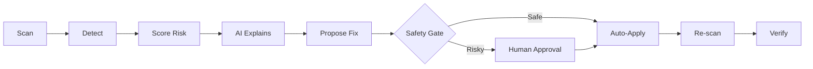
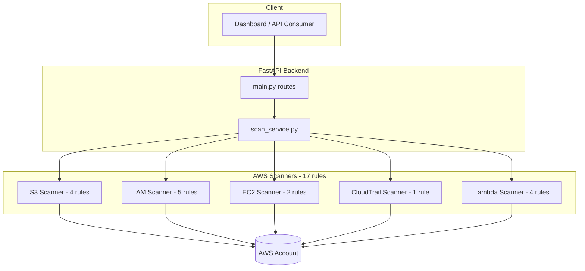

# 🛡️ CloudSentinel

**AI-Powered AWS Cloud Security Scanning & Auto-Remediation Platform**

**Team CyberSentinel:** Nayef - Masooma - Sireen

---

## Overview

CloudSentinel continuously discovers AWS resources, detects security misconfigurations, scores risk, and (in later phases) uses AI to explain findings and safely auto-remediate them, with a human approval gate for anything with real blast radius.

The detection layer is complete: 17 real, verified rules across 5 AWS services, fully tested, documented, and running against a live account.

## Pipeline

## Architecture

---

## Status

| Module | Status | Details |
|---|---|---|
| AWS Connector | Done | Authenticated boto3 session |
| S3 Scanner | Done | Block Public Access, Public bucket, Versioning, Encryption |
| IAM Scanner | Done | Root MFA, Password policy, User MFA, Wildcard perms, Old keys |
| EC2 Scanner | Done | SSH/RDP exposed, Unrestricted inbound |
| CloudTrail Scanner | Done | Logging disabled (region/ARN-safe) |
| Lambda Scanner | Done | Excessive perms, Public URL, Secrets in env, Missing KMS encryption |
| FastAPI Layer | Done | /scan + per-service endpoints, graceful per-scanner error handling |
| Unit Tests | Done | 25 passing, mocked, full 5-service coverage |
| Labeled Dataset | Done | 340 configs across all 5 services |
| CI | Done | GitHub Actions runs tests on every push |
| Test Lab Scripts | Done | Reusable setup/teardown for demos |
| Risk Engine | Planned | Owner: Masooma |
| AI Engine | Planned | Owner: Masooma |
| Remediation | Planned | Owner: Masooma |
| Dashboard | Planned | Owner: Sireen |

17 real detection rules, verified true-positive and true-negative against a live AWS account, including root account hygiene fixes and a real CloudTrail trail, not just test resources.

---

## Tech Stack

| Layer | Choice |
|---|---|
| Backend | Python + FastAPI |
| AWS SDK | boto3 (paginated calls for IAM/EC2) |
| Testing | pytest + unittest.mock |
| CI | GitHub Actions |
| Frontend (planned) | React + Vite |
| Database (planned) | PostgreSQL |
| AI Layer (planned) | API-based LLM |

---

## Quick Start

Clone the repo:
git clone https://github.com/nayefsiddique-eng/CloudSentinal.git
cd CloudSentinal

Virtual environment:
python -m venv venv
.\venv\Scripts\Activate.ps1

Install dependencies:
pip install -r requirements.txt

Configure AWS credentials:
copy .env.example .env
(then edit .env with your AWS_ACCESS_KEY_ID / AWS_SECRET_ACCESS_KEY)

Run:
uvicorn backend.main:app --reload

Open http://127.0.0.1:8000/docs for the interactive Swagger UI.

### Running tests
pytest tests/ -v

### Setting up a demo test lab
.\scripts\setup_test_lab.ps1
.\scripts\teardown_test_lab.ps1

### Generating the labeled dataset
python scripts/generate_dataset.py

---

## API Endpoints

| Method | Endpoint | Description |
|---|---|---|
| GET | /health | Health check |
| GET | /scan | Runs all scanners, combined findings + severity summary |
| GET | /scan/s3 | S3 findings only |
| GET | /scan/iam | IAM findings only |
| GET | /scan/ec2 | EC2 security group findings only |
| GET | /scan/cloudtrail | CloudTrail findings only |
| GET | /scan/lambda | Lambda findings only |

Example finding:
{
  "resource_id": "example-bucket",
  "resource_type": "s3_bucket",
  "finding": "Bucket is publicly accessible",
  "severity": "HIGH",
  "category": "PUBLIC_ACCESS",
  "evidence": { "public": true },
  "status": "OPEN"
}

/scan response shape:
{
  "total_findings": 24,
  "severity_summary": { "CRITICAL": 1, "HIGH": 2, "MEDIUM": 3, "LOW": 0, "INFO": 18 },
  "findings": [ ],
  "errors": [ ]
}

Severity scale: CRITICAL, HIGH, MEDIUM, LOW, INFO

---

## Project Structure

CloudSentinel/
  .github/workflows/
    tests.yml                 CI: runs pytest on every push
  backend/
    main.py                   FastAPI app and routes
    services/
      scan_service.py         Aggregates all scanners
      aws/
        client.py             Authenticated boto3 session
        account.py            Account identity check
        s3.py                 S3 scanner (4 rules)
        iam.py                IAM scanner (5 rules)
        ec2.py                EC2 scanner (2 rules, paginated)
        cloudtrail.py         CloudTrail scanner (region/ARN-safe)
        lambda_scanner.py     Lambda scanner (4 rules)
  dataset/
    secure/                   Labeled secure configs
    vulnerable/                Labeled vulnerable configs
    labels/ground_truth.json
  scripts/
    generate_dataset.py       Builds the labeled dataset
    setup_test_lab.ps1        Creates demo AWS resources
    teardown_test_lab.ps1     Tears them down
  tests/
    test_scanners.py          25 unit tests, all scanners mocked
  HANDOFF.md                  Notes for Masooma and Sireen
  .env.example
  requirements.txt

---

## Team Roles

| Person | Role | Owns |
|---|---|---|
| Nayef | AWS Security and Detection Lead | Resource discovery, security rules, dataset - complete |
| Masooma | AI and Remediation Lead | Risk scoring, AI analysis, remediation, safety controls, verification |
| Sireen | Platform and Research Lead | Backend APIs, database, dashboard, testing, evaluation |

---

## Security Notes

- The scanner identity (cloudsentinel-dev) is intentionally read-only.
- A separate admin identity is used only for test-lab setup, never by scanner code.
- Dangerous remediation actions (e.g. IAM admin changes) will always require manual approval.
- No high-blast-radius action will ever auto-execute without a safety gate.
- Root account MFA and a real password policy are enabled on the AWS account used for development.
- A real CloudTrail trail is active, logging all management events.

---

Built for a final-year cybersecurity project - CyberSentinel Team
