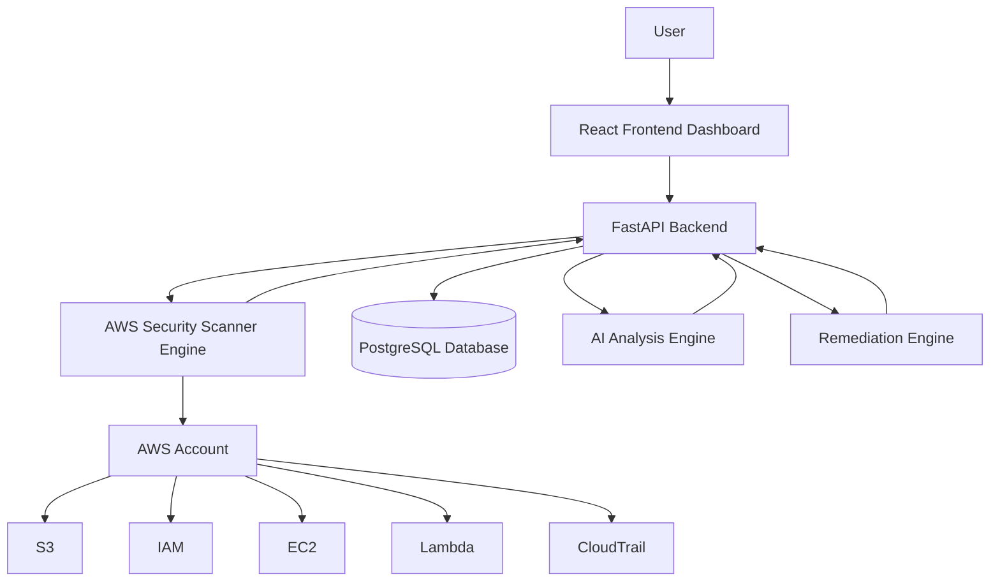
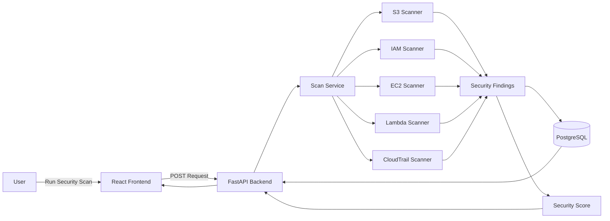
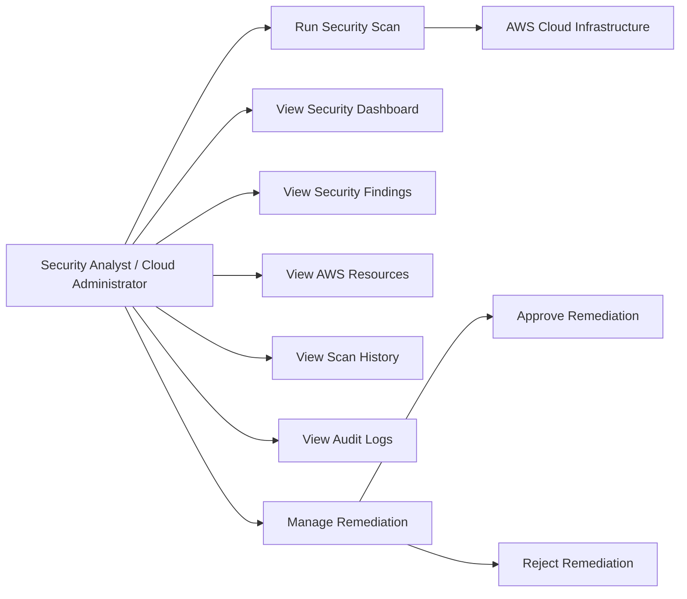
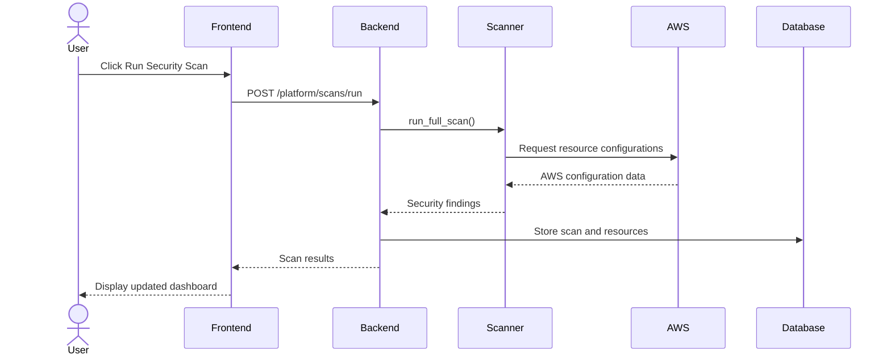
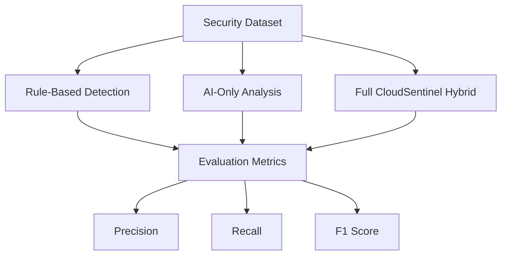

# CloudSentinel System Diagrams

## 1. High-Level System Architecture

---

## 2. Security Scan Data Flow

---

## 3. Use Case Diagram

---

## 4. Security Scan Sequence

---

## 5. Evaluation Workflow

